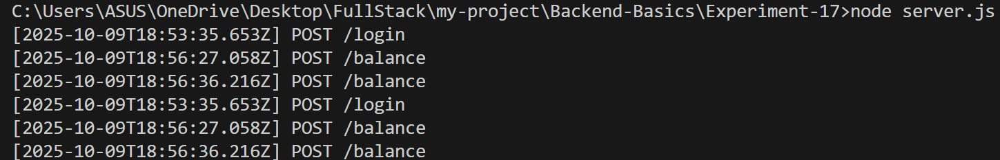
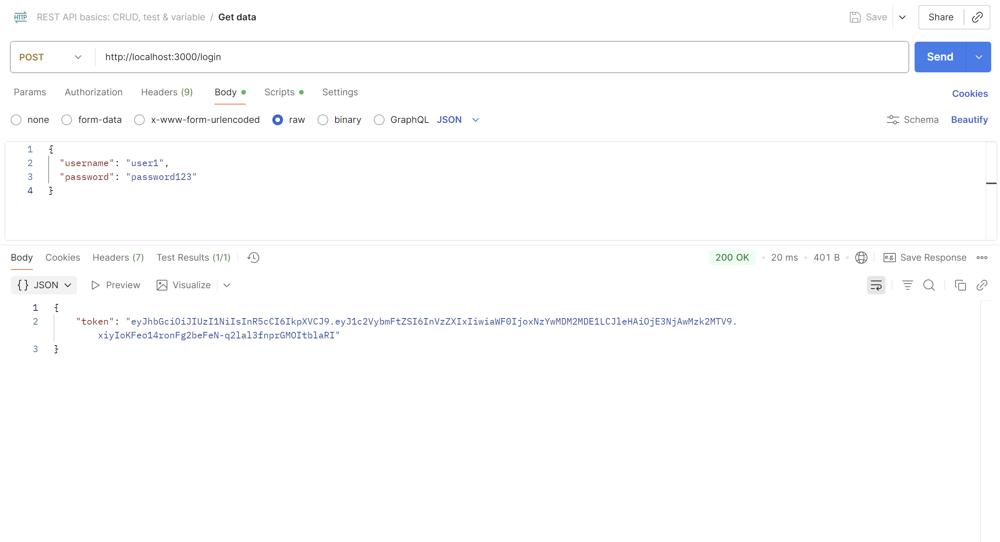
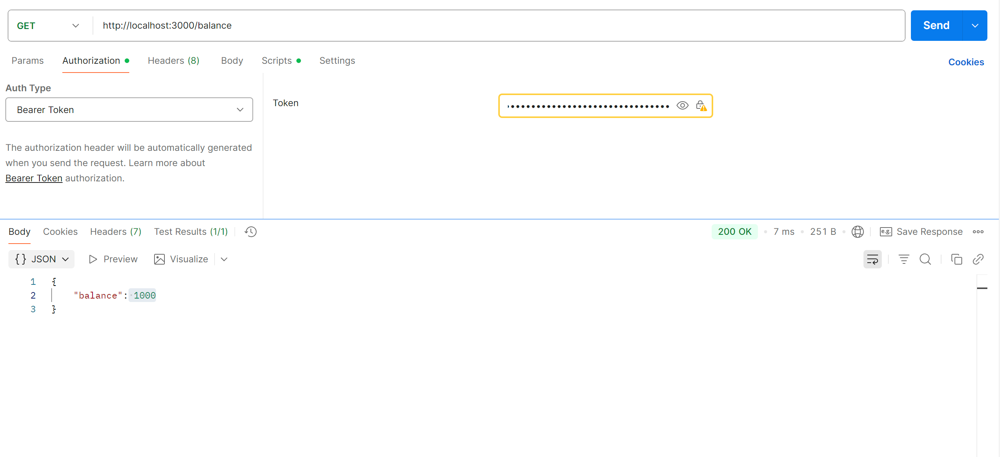
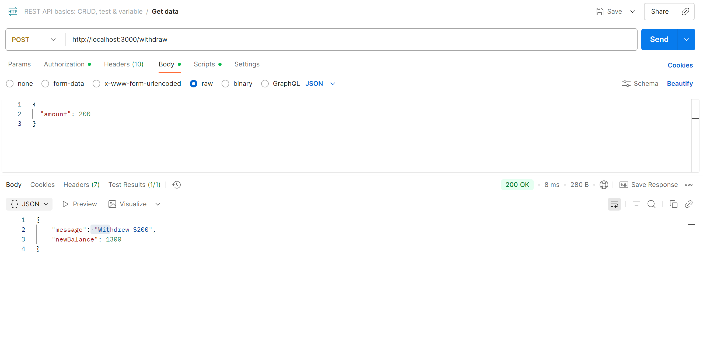
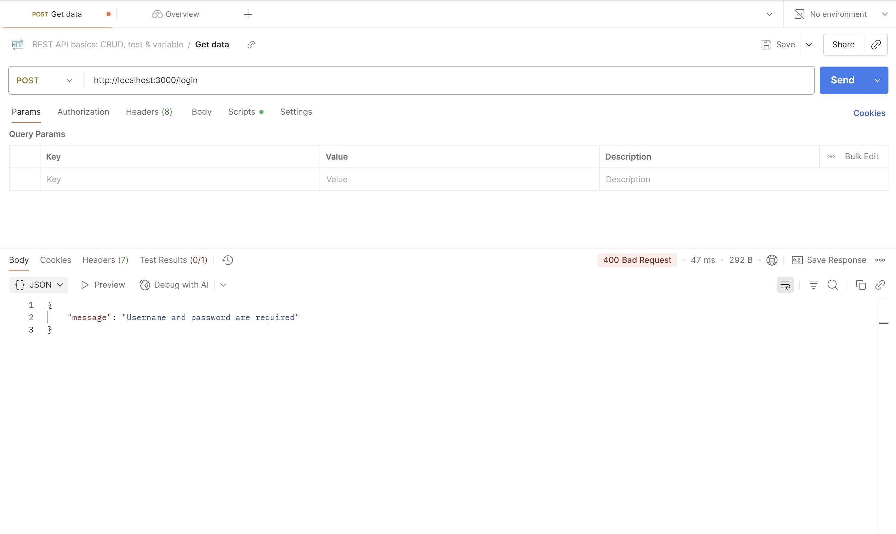

# Banking API Server

A secure RESTful Banking API built with Node.js, Express, and JWT authentication that provides basic banking operations including user authentication, balance checking, deposits, and withdrawals.

## 🚀 Features

- **JWT Authentication** - Secure token-based authentication
- **Banking Operations** - Deposit, withdraw, and check balance
- **Request Logging** - Detailed request monitoring
- **Error Handling** - Comprehensive error management
- **Input Validation** - Robust data validation

## 📋 Prerequisites

- Node.js (v14 or higher)
- npm or yarn
- Postman (for API testing)

## Installation
**Initialize project and install dependencies**

```bash
npm init -y
npm install express jsonwebtoken
npm install --save-dev nodemon
```
## Running the Server

### Terminal Commands
1. **Start the server**
```bash
node server.js
```

2. **Expected terminal output**
```bash
Server running on http://localhost:3000
```

3. **Server logs example**
```bash
[2024-01-01T10:30:00.000Z] GET /balance
[2024-01-01T10:31:00.000Z] POST /deposit
[2024-01-01T10:32:00.000Z] POST /withdraw
```

4. **Stop the server**
```bash
Ctrl + C
```

## API Documentation
### Base URLs
```arduino
http://localhost:3000
```

### Endpoints
1. **Login**
POST /login
Get JWT token for authentication.

Request Body:
```bash
{
  "username": "user1",
  "password": "password123"
}
```

2. **Get Balance**

GET /balance
Get current account balance (Protected route).

Headers:
```makefile
Authorization: Bearer <your_token>
```

3. **Deposit Money**

POST /deposit
Deposit money into account (Protected route).

Headers:
```makefile
Authorization: Bearer <your_token>
Content-Type: application/json
```
Request Body:
```json
{
  "amount": 500
}
```

4. **Withdraw Money**

POST /withdraw
Withdraw money from account (Protected route).

Headers:
```makefile
Authorization: Bearer <your_token>
Content-Type: application/json
```

Request Body:
```json
{
  "amount": 200
}
```
## Testing with Postman
### Environment Setup

1. Create new Collection: "Banking API"

2. Set Environment Variables:
- base_url: http://localhost:3000

- token: (will be auto-populated)

### Step-by-Step Testing
**Step 1: Login Request**

- Method: POST
- URL: {{base_url}}/login
- Headers: Content-Type: application/json
- Body (raw JSON):
```json 
{
  "username": "user1",
  "password": "password123"
}
```

**Step 2: Protected Routes Setup**

For all protected routes (/balance, /deposit, /withdraw):

1. Authorization Tab:

- Type: Bearer Token
- Token: {{token}}

2. Headers auto-generate:
- Authorization: Bearer <token>
- Content-Type: application/json (for POST requests)

**Complete Testing Workflow**

| Step | Endpoint    | Method | Expected Result               |
| ---- | ----------- | ------ | ----------------------------- |
| 1    | `/login`    | POST   | Get JWT token                 |
| 2    | `/balance`  | GET    | Check initial balance ($1000) |
| 3    | `/deposit`  | POST   | Deposit $500 → Balance $1500  |
| 4    | `/balance`  | GET    | Confirm $1500 balance         |
| 5    | `/withdraw` | POST   | Withdraw $200 → Balance $1300 |
| 6    | `/balance`  | GET    | Confirm $1300 balance         |

## Error Handling
**Common Error Responses**
| Error Scenario               | Status Code | Response Message               |
| ---------------------------- | ----------- | ------------------------------ |
| Invalid credentials          | 401         | `Invalid credentials`          |
| Missing authorization header | 401         | `Authorization header missing` |
| Invalid token format         | 401         | `Invalid authorization format` |
| Expired/invalid token        | 403         | `Invalid or expired token`     |
| User not found               | 404         | `User not found`               |
| Invalid amount               | 400         | `must be a positive number`    |
| Insufficient funds           | 400         | `Insufficient balance`         |
| Server error                 | 500         | `Something went wrong`         |


## Testing Error Scenarios
1. Invalid Login
```bash
{
  "username": "wronguser",
  "password": "wrongpass"
}
```

2. Missing Token
- Don't include Authorization header

3. Invalid Amount
```json
{
  "amount": -100
}
```

4. Overdraft Attempt
```json
{
  "amount": 5000
}
```

## Code Structure
**Server.js Components**
| Section            | Purpose                 | Key Features                      |
| ------------------ | ----------------------- | --------------------------------- |
| **Dependencies**   | Import required modules | Express, JWT, configuration       |
| **Middleware**     | Request processing      | JSON parsing, logging, CORS       |
| **Data Storage**   | User accounts           | In-memory user data               |
| **Auth Functions** | JWT handling            | Token generation & verification   |
| **Routes**         | API endpoints           | Login, balance, deposit, withdraw |
| **Error Handler**  | Global error handling   | Catch-all error middleware        |

**Key Configuration**
| Constant       | Purpose           | Default Value    |
| -------------- | ----------------- | ---------------- |
| `PORT`         | Server port       | 3000             |
| `JWT_SECRET`   | Token signing key | `supersecretkey` |
| `TOKEN_HEADER` | Auth header name  | `authorization`  |

## Output (Screenshots)

#### 1. Server Running


#### 2. Login Response


#### 3. Get Balance


#### 4. Deposit Money


#### 5. Withdraw Money


#### 6. Login Requirements



## Learning Outcomes
### Backend Development Concepts
| Concept                 | Implementation                    | Skills Gained                |
| ----------------------- | --------------------------------- | ---------------------------- |
| **RESTful API Design**  | HTTP methods + semantic endpoints | API architecture planning    |
| **Middleware Pipeline** | Custom logger, error handling     | Request lifecycle management |
| **JWT Authentication**  | Token generation & verification   | Secure auth implementation   |
| **Error Handling**      | Status codes, error responses     | API error best practices     |
| **Input Validation**    | Data type and value checking      | Security and data integrity  |

### Technical Skills Developed
| Skill Area     | Specific Competencies                                 |
| -------------- | ----------------------------------------------------- |
| **Node.js**    | Express framework, module system, server creation     |
| **Security**   | JWT tokens, route protection, input sanitization      |
| **API Design** | Endpoint structure, HTTP methods, response formatting |
| **Testing**    | Postman collections, error scenario testing           |
| **Debugging**  | Request logging, error tracking, status codes         |

## Production Considerations
| Current Implementation | Production Recommendation                 |
| ---------------------- | ----------------------------------------- |
| In-memory storage      | Database integration (MongoDB/PostgreSQL) |
| Plain text passwords   | Password hashing (bcrypt)                 |
| Hard-coded secret      | Environment variables for secrets         |
| Single user            | Multi-user system with roles              |
| Basic validation       | Comprehensive input sanitization          |
