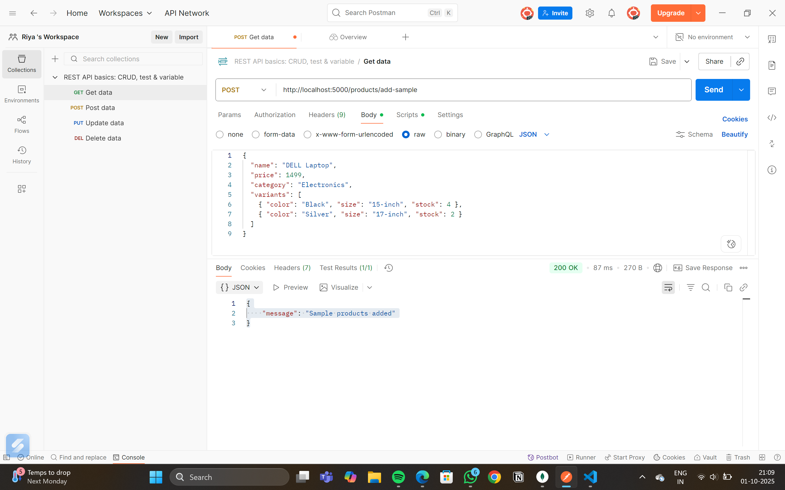
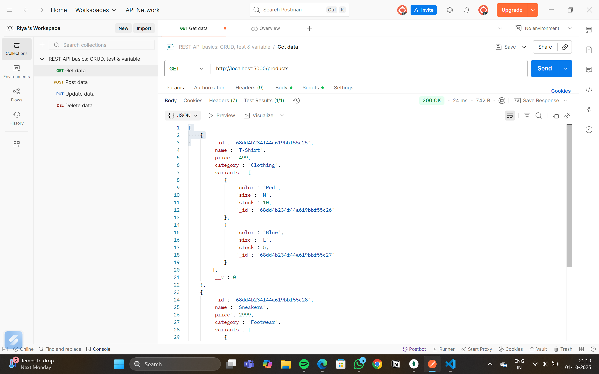
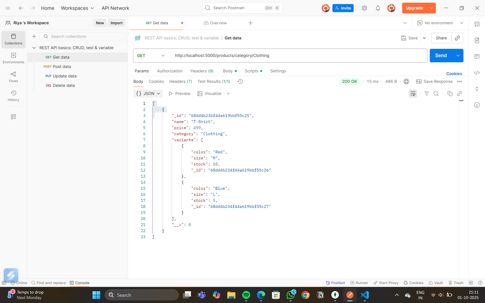
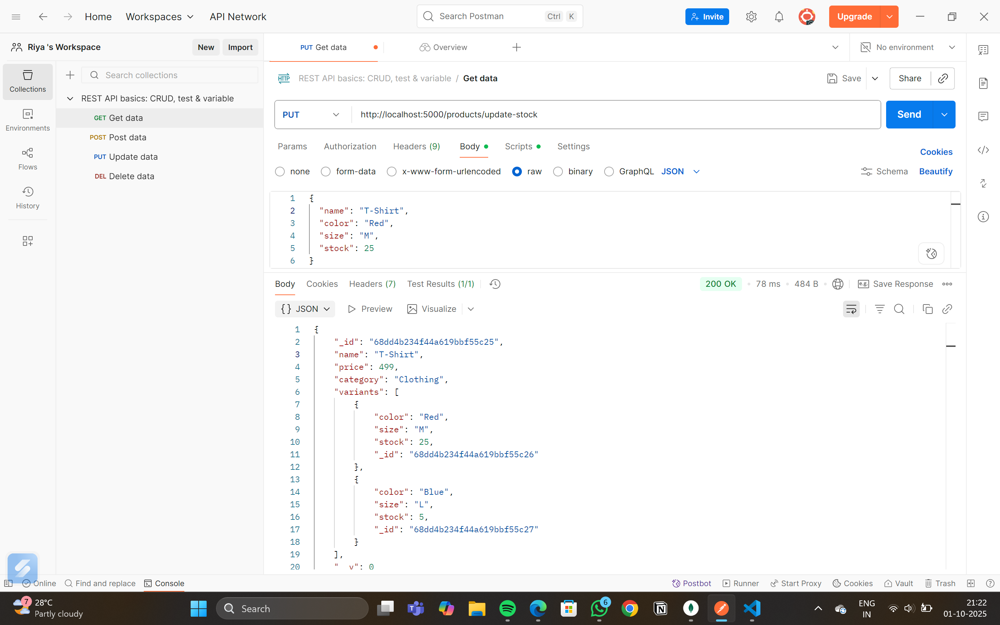
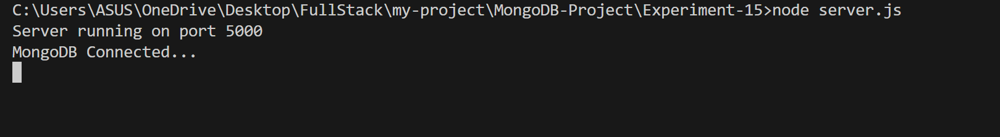
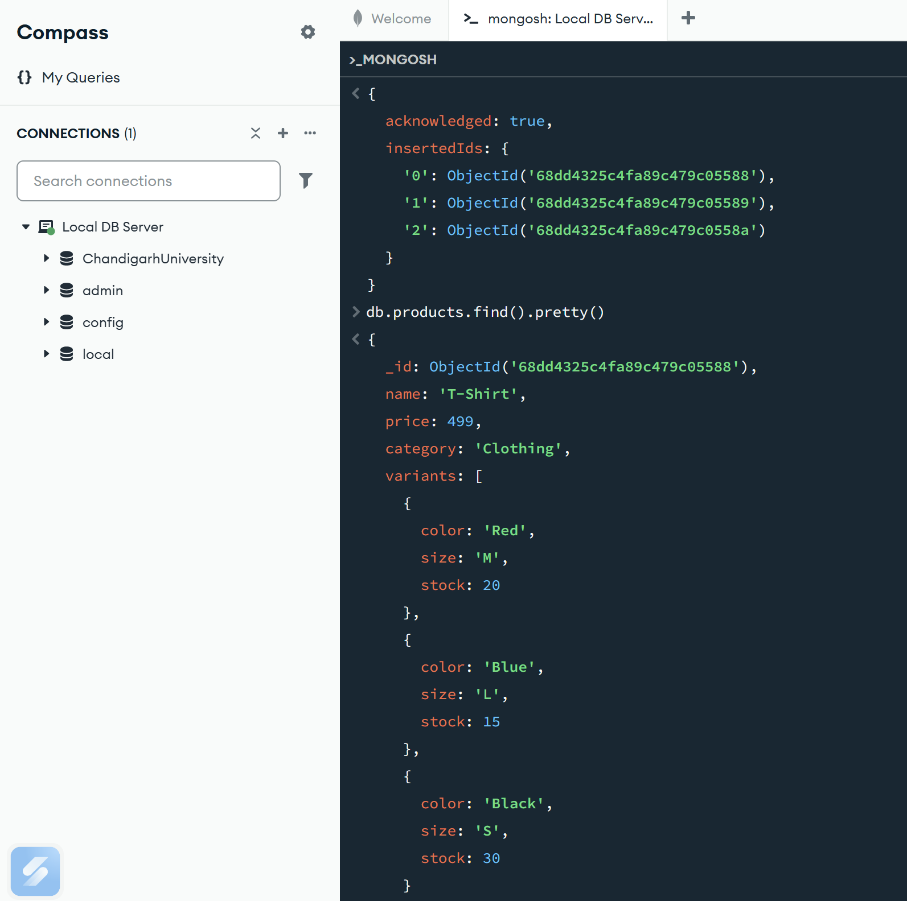
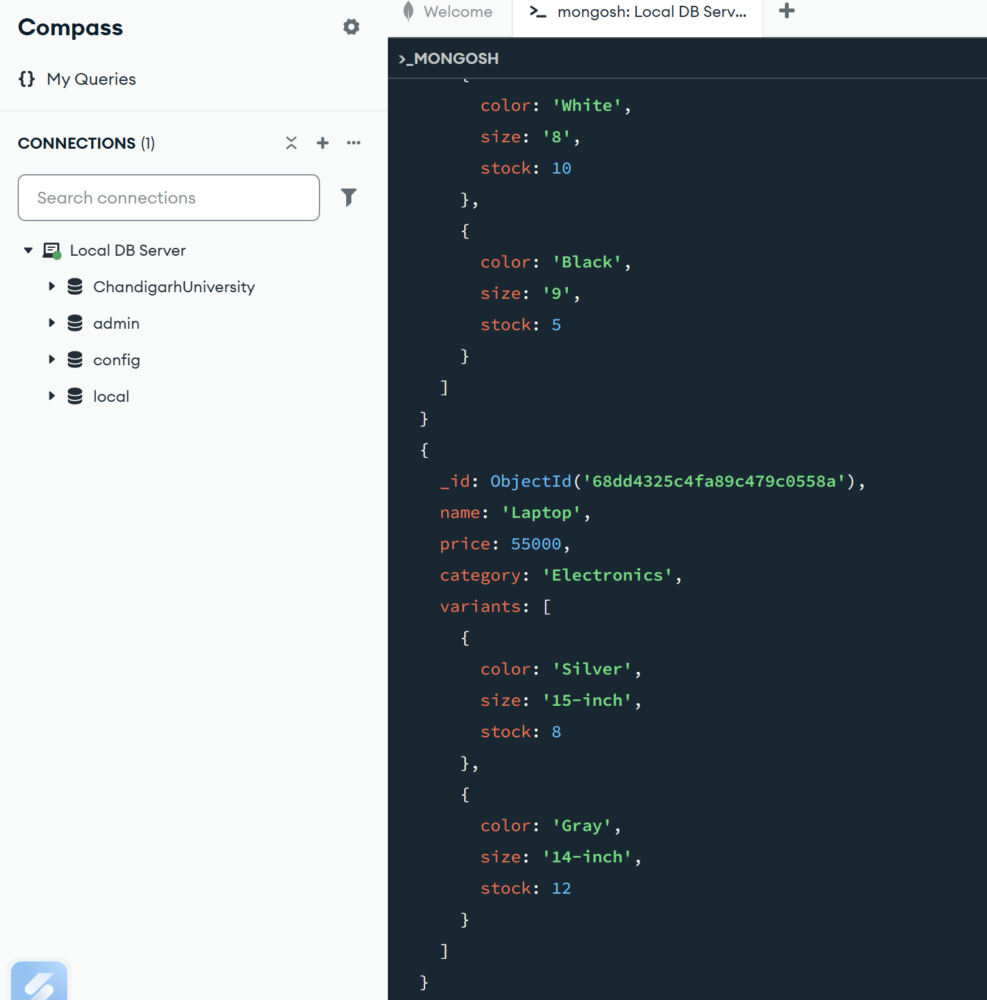

# E-commerce Catalog with Nested Document Structure in MongoDB

## Objective
The goal of this project is to design and implement an *E-commerce Catalog* using *MongoDB with nested documents* and follow the *MVC (Model–View–Controller) architecture* in Node.js.  

This project demonstrates how to:
- Represent real-world e-commerce data using MongoDB’s flexible document model.  
- Use *nested documents* (e.g., product variants such as size, color, and stock).  
- Organize code using MVC for clean, maintainable APIs.  
- Implement CRUD operations (Create, Read, Update) with Express & Mongoose.  
- Test APIs using *Postman*.  

## 📂 Project Structure

```bash
MongoDB-Project/
│── server.js # Entry point (starts Express server)
│── config/
│ └── db.js # MongoDB connection setup
│── models/
│ └── product.js # Product schema & model
│── controllers/
│ └── productController.js # Business logic for products
│── routes/
│ └── productRoutes.js # REST API endpoints
│── README.md # Project documentation
```

## Data Model (MongoDB Collections)

### 1. *Products Collection*
Each product is stored as a document inside the products collection.  
The structure includes basic product fields and a nested array of variants.

- *Fields*
  - name → Product name (e.g., "T-Shirt", "Sneakers").  
  - price → Base price of the product.  
  - category → Category (e.g., Clothing, Footwear, Accessories).  
  - variants → Array of objects (nested documents) containing:  
    - color → Variant color.  
    - size → Variant size (e.g., M, L, 9, 10).  
    - stock → Available quantity for that variant.  

*Example Document :*
```bash
Product {
name: "T-Shirt",
price: 499,
category: "Clothing",
variants: [
{ color: "Red", size: "M", stock: 10 },
{ color: "Blue", size: "L", stock: 5 }
]
}
```

## Explanation of Code Flow

### 1. **Server Setup (server.js)**
- Initializes Express app.  
- Connects to MongoDB using Mongoose.  
- Loads routes for /products.  
- Starts the server on a given port (default: 5000).  


### 2. **Database Configuration (config/db.js)**
- Uses Mongoose to establish a connection with MongoDB (mongodb://127.0.0.1:27017/ecommerceDB).  
- Prints a success message once connected.  


### 3. **Model (models/product.js)**
- Defines the *schema* for a product.  
- Contains nested variants array (each element with color, size, stock).  
- Exports a Mongoose model called Product to interact with MongoDB.  

### 4. **Controller (controllers/productController.js)**
Handles business logic for product operations:  

- *Add Sample Products* → Inserts multiple pre-defined products with variants.  
- *Get All Products* → Retrieves every product document from MongoDB.  
- *Filter by Category* → Finds products where category matches a given parameter (e.g., Clothing).  
- *Project Variants* → Retrieves only product names and selected fields from variants (e.g., color and stock).  
- *Update Stock (PUT)* → Finds a specific variant (by product ID or name + color + size) and updates its stock count.  


### 5. **Routes (routes/productRoutes.js)**
Defines REST API endpoints and maps them to controllers:  

- POST /products/add-sample → Insert sample data.  
- GET /products → Retrieve all products.  
- GET /products/category/:category → Retrieve by category.  
- GET /products/variants → Retrieve only variant details.  
- PUT /products/update-stock → Update variant stock.  


## Testing with Postman

1. *POST* → /products/add-sample  
   Inserts example products.  

2. *GET* → /products  
   Returns all products.  

3. *GET* → /products/category/Clothing  
   Returns products in the Clothing category.  

4. *GET* → /products/variants  
   Returns only names and variant details (color, stock).  

5. *PUT* → /products/update-stock  
   Updates stock for a specific variant. Example request body:
```bash
{
"name": "T-Shirt",
"color": "Red",
"size": "M",
"stock": 25
}
```


## Postman API Endpoints

| Method | Endpoint                          | Description                        | Request Body (JSON) Example |
|--------|----------------------------------|------------------------------------|-----------------------------|
| POST   | /products/add-sample              | Insert sample products             | None                        |
| GET    | /products                         | Retrieve all products              | None                        |
| GET    | /products/category/:category      | Retrieve products by category      | None                        |
| GET    | /products/variants                | Retrieve product names & variant details | None                        |
| PUT    | /products/update-stock            | Update stock for a specific variant | { "name": "T-Shirt", "color": "Red", "size": "M", "stock": 25 } |

## How to Run the Project

### 1. Prerequisites
- *Node.js & npm* installed ([Download Node.js](https://nodejs.org/))  
- *MongoDB* installed and running ([Download MongoDB](https://www.mongodb.com/try/download/community))  
- *Postman* installed (optional, for testing APIs)  

### 2. Clone or Download Project
```bash
cd MongoDB-Project
```

### 3. Install Dependencies
Install required Node.js packages:
```bash
npm install
```

### 4. Start MongoDB
Make sure MongoDB server is running. If installed locally:
```bash
mongod
```

By default, the app connects to mongodb://127.0.0.1:27017/ecommerceDB.

### 5. Start the Server
```bash
npm start
```

## Outputs:

### 1. POST Sample Product Document


### 2. GET Product List


### 3. GET Product by Category


### 4. PUT Update Stock by Name of Product


### 5. How to run on Terminal


### 6. MongoShell Adding Sample




## Key Learnings
- How to *design nested MongoDB schemas* for real-world use cases.  
- How *MVC structure* separates concerns:  
- Model → Data representation.  
- Controller → Business logic.  
- Routes → API definition.  
- Using *Postman* for API testing.  
- Handling *nested document updates* in MongoDB.